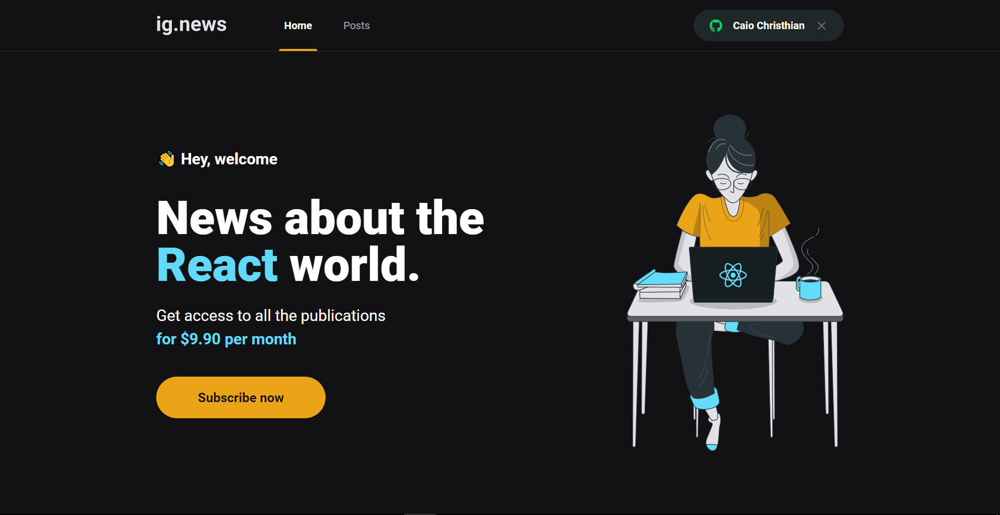
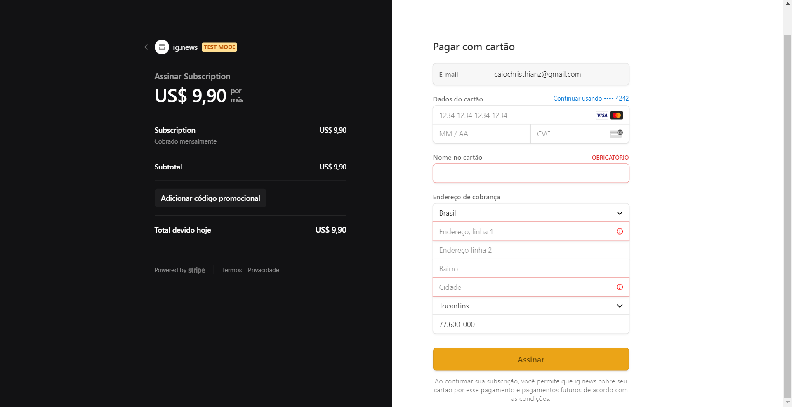

<h1 align="center">
    ignews 
</h1>

  <a href="#-tecnologias">Tecnologias</a>&nbsp;&nbsp;&nbsp;|&nbsp;&nbsp;&nbsp;
  <a href="#-projeto">Projeto</a>&nbsp;&nbsp;&nbsp;|&nbsp;&nbsp;&nbsp;

 

Home

  

 

Página de redirecionamento do botão subscribe, onde é efetuado o pagamento através do stripe

  

## 🚀 Tecnologias

Esse projeto foi desenvolvido com as seguintes tecnologias:

- TypeScript
- sass
- Next.js
- Stripe
- FaunaDB
- Axios

## 💻 Projeto

Este projeto é uma aplicação de noticias sobre React ou qualquer outro assunto,
mas neste exemplo no ignite foi React, nele eu tive uma chuva de informações,
aprendi a utilizar o next, usei o stripe como forma de pagamento, FaunaDB para
guardar as informações no banco além de webhooks e ainda outros conceitos como
autenticar o usuário e várias outras regras de negócio. Ainda não está completo,
mas está quase pronto.